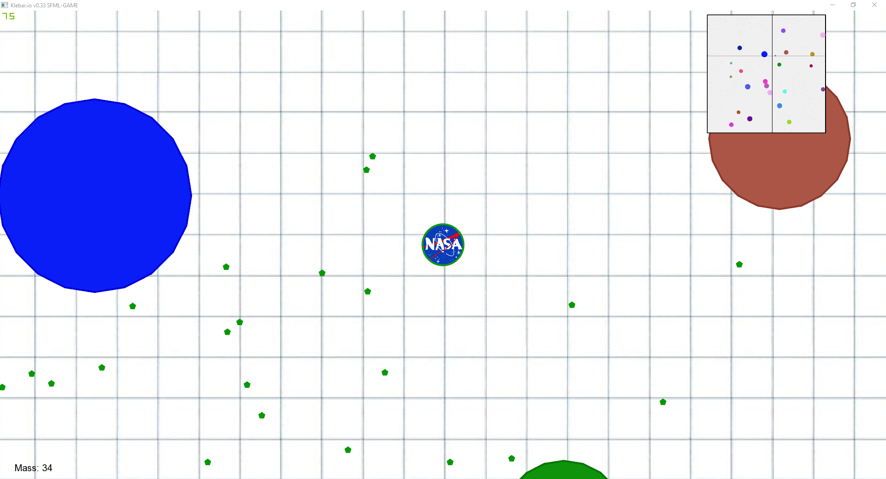

Klebar.io 
===================================
A fun version of [Agar.io](https://agar.io/) created for education purposes.

# Visuals

---

---

# Possible directions of development:

* Better CheatingMode (home key activate faster movement)
* Random textures on enemies
* Enemies with AI
* Fix food overlapping problem
* Eating animation
* Add game-reset button
* Add night game mode
* Add menu
* Processing calculations only for visible on screen objects
* Multiplayer

# Instalation:
<https://www.sfml-dev.org/tutorials/2.5/start-vc.php>

# Contributing

Pull requests are welcome. For major changes, please open an issue first to discuss what you would like to change.

Please make sure to update tests as appropriate.

# Author

[Jakub Kleban](https://github.com/klebann)

# License
[GPL](https://www.gnu.org/licenses/gpl-3.0.en.html)